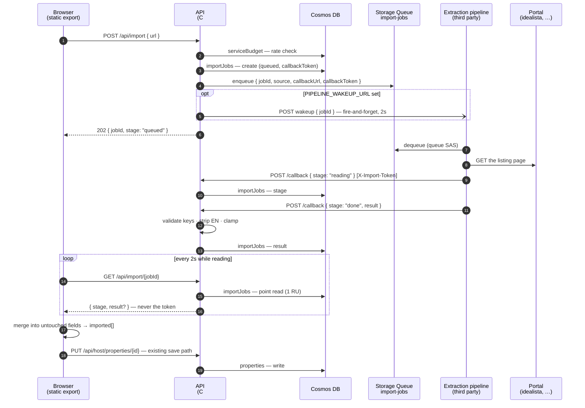

# AI-assisted import ("Start faster") — design

**Date:** 2026-07-30
**Branch:** `feat/ai-assisted-import`
**Design handoff:** `Projects/design_handoff_new_property_with_ai_assitant/`
— `AI-import-handover.md` and README §10.
**Decision log:** ADR-033. Relates to ADR-020 (the DeepSeek assistant),
ADR-030 (the wizard), ADR-032 (the description schema).

---

## Goal

An owner arriving at *Add a property* usually has the flat listed somewhere
already. Retyping it is why drafts get abandoned. This feature reads what they
have, proposes it, and makes the proposal obviously a proposal.

It sits **in front of** the nine wizard steps and changes nothing inside them
except one banner per step and one glyph per imported field. It can be dropped
without touching the wizard.

## Scope

**Phase 1 (this spec):** the URL flow, end to end — start screen, reading
screen, job spine in the API, marks and banners in the wizard, client-side
merge. Verified against a stub extractor.

**Phase 1 does not ship:** the document flow. Card B of the start screen is not
rendered. See *Open questions* — the document flow has an unresolved privacy
question that the URL flow does not have.

**Never in scope:** the extraction pipeline itself. It is a third-party service
that does not exist yet. This spec defines the contract it must honour and
nothing about its internals.

---

## Architecture

### The constraint that settles the shape

Azure Static Web Apps caps every `/api` request at **45 seconds** and managed
functions accept **HTTP triggers only**
([apis-overview](https://learn.microsoft.com/en-us/azure/static-web-apps/apis-overview)).
Extraction takes 30s+. So a synchronous endpoint was never available, whatever
we might have preferred: the reading screen is not a UX flourish, it is the
architecture.

Everything below is HTTP or an SDK *write*. Nothing needs a queue trigger, a
change-feed trigger or a timer, so **we stay on managed functions on the Free
plan**. Moving to Standard/BYOF would cost ~$9/mo, a second Function App with
its own storage and deploy pipeline, and SWA pull-request preview environments
(BYOF cannot be linked to them) — in exchange for capabilities this design does
not use. The C# is portable either way; it is hosting configuration, not code,
so the decision stays cheap to revisit.

### Who calls whom



### What that diagram is really saying

Three properties fall out of it, and they are the reasons to build it this way:

1. **The pipeline never touches Cosmos, and never touches `properties`.** It
   reads a queue and POSTs an HTTP callback. It holds no database credential,
   no storage account key, and no knowledge of `PropertyDoc`.
2. **The import result lands on the *job*, not on the listing.** The merge is
   client-side, because only the client knows which fields the owner has
   already typed into (§10.2: an arriving import may fill only untouched
   fields). So `HostWrites.cs` validation is untouched and the import adds
   **no new writer to the `properties` container**.
3. **A forged callback can poison one job's proposal and nothing else.** The
   proposal arrives visibly marked and editable. Blast radius is close to zero
   — which is what makes an anonymous callback endpoint acceptable at all.

Only the pipeline ever fetches the portal. We do not scrape, we do not store
the source page, and we do not re-host its images (§10.6, legal).

---

## The job document

New Cosmos container **`importJobs`**, partition key `/id`, `defaultTtl`
604800 (7 days). The only access pattern is a point read by job id, so `/id` is
the right key and a poll costs **1 RU**.

```jsonc
{
  "id": "imp_...",                  // job id == partition key
  "ownerId": "<x-ms-client-principal userId>",
  "source": {
    "kind": "url",                  // discriminator — "document" slots in later
    "host": "idealista",
    "url": "https://www.idealista.com/inmueble/107294518/"
  },
  "stage": "queued",                // see below
  "createdAt": "2026-07-30T09:12:04Z",
  "updatedAt": "2026-07-30T09:12:04Z",
  "deadlineAt": "2026-07-30T09:17:04Z",   // createdAt + 5 min
  "callbackToken": "<32 random bytes, base64url>",
  "result": null,
  "error": null,
  "ttl": 604800
}
```

`source` is a **discriminated union from day one**, so adding
`{ "kind": "document", "blob": "...", "pages": 4 }` later is additive and does
not version the pipeline contract. This is what makes "URL first" free rather
than a deferred cost.

**`callbackToken` must never reach the client.** It gets an `ImportJobView`
projection, the same pattern as the existing `HostProjection` in
`api/Models/HostModels.cs`.

### Stages

```
queued → fetching → reading → matching → done
                                       ↘ failed
        (any) ────────────────────────→ cancelled
```

`done`, `failed` and `cancelled` are terminal. A callback arriving on a
terminal job is a **409 no-op**, not an error to retry — that is what makes the
pipeline's at-least-once delivery safe.

Progress is this enum and nothing else. **No percentage, no bar.** The duration
is not knowable and a bar that stalls at 80% is a lie with a number on it
(§10.2).

---

## Endpoints

All four live in a new `api/Functions/ImportFunctions.cs`.

### `POST /api/import`

Authenticated; owner from `x-ms-client-principal`.

```jsonc
// request
{ "url": "https://www.idealista.com/inmueble/107294518/" }
// 202
{ "jobId": "imp_...", "stage": "queued" }
```

Steps: re-check the host allowlist server-side → check rate limits → create the
job → enqueue → optional wakeup → return. Never fetches anything.

Errors: `400 unsupported_host`, `400 bad_url`, `429 too_many_imports`,
`429 daily_import_limit`.

### `GET /api/import/{jobId}`

Authenticated; `ownerId` must match or `404` (not `403` — a job id is not a
thing to confirm the existence of).

Returns `ImportJobView`: `{ jobId, source: { kind, host }, stage, createdAt,
result, error }`. No token, no full URL echo beyond what the client already
has.

**This endpoint is the reaper.** A job found in a non-terminal stage past
`deadlineAt` is written to `failed` with `error.code = "timeout"` before the
response is composed. That is why no timer trigger is needed — the same lazy
pattern `RouteCache` already uses for stale geometry.

### `POST /api/import/{jobId}/callback`

**Anonymous.** Authenticated by an `X-Import-Token` header compared to the
job's `callbackToken` with a **fixed-time comparison**
(`CryptographicOperations.FixedTimeEquals`). A mismatch is `404`, never `403`.

```jsonc
{ "stage": "reading" }
{ "stage": "done", "result": { "listing": {...}, "pricing": {...}, "imported": [...] } }
{ "stage": "failed", "error": { "code": "login_wall" } }
```

Idempotent. Out-of-order stage reports are accepted but never move a job
backwards along the stage order.

`/api/*` carries no SWA route rules today — authorization is enforced in the C#
functions (CLAUDE.md) — so an anonymous route here is a matter of not calling
the principal check, not a configuration fight.

### `DELETE /api/import/{jobId}`

Authenticated; owner. §10.2's quiet *Stop reading*. Sets `cancelled`. The
pipeline's later callback gets its 409 and stops.

---

## The queue

Storage Queue **`import-jobs`** on the existing storage account (`-poison`
created automatically after 5 dequeues). No new resource, no cost floor.

```jsonc
{
  "jobId": "imp_...",
  "source": { "kind": "url", "host": "idealista", "url": "https://..." },
  "callbackUrl": "https://<swa-host>/api/import/imp_.../callback",
  "callbackToken": "...",
  "deadlineAt": "2026-07-30T09:17:04Z"
}
```

Self-contained: the pipeline never reads our database to find out what to do.

**Why a queue and not the Cosmos change feed.** The storage account already
exists for photos, so this adds nothing. The queue brings visibility timeout,
dequeue count and a poison queue — retry semantics for free. The change feed
brings none of those; we would rebuild them. It also needs a lease container
(extra RU on a free-tier account), and it delivers *every* write to the job
document including our own stage updates, so the consumer must filter and be
idempotent. Decisively: the integration contract for a service that does not
exist yet should be "read a queue message", not "host a change-feed processor
against our database".

**Polling cost is not a real concern here.** A 10-second queue poll is ~8,640
transactions/day ≈ **$0.0004/day** at Storage Queue rates. That worry applies
to polling a hosted HTTP service, not a storage queue. Do not design around it.

**The wakeup is optional and advisory.** If `PIPELINE_WAKEUP_URL` is set, we
POST `{ jobId }` after enqueuing with a 2-second timeout and ignore the
outcome. The queue stays the source of truth, so a failed wakeup costs latency,
not the job. It stays unset until the pipeline exists.

### Credentials, given a third-party pipeline

- **Queue:** a SAS with process-only permission, rotatable without a code
  change.
- **Callback:** the per-job token. Not a global shared secret — a leaked token
  is scoped to one job and dies with it (7-day TTL, or sooner at terminal
  stage).

That is the entire credential surface. There is deliberately nothing else to
leak.

---

## The callback enforces policy; it does not trust the pipeline

Three checks at that boundary, none of them assumptions:

**1 · `imported[]` against a closed key vocabulary.** Unknown key → the whole
callback is rejected `400 unknown_field`. It is never inferred from "field is
non-empty" (§10.6) — a field the owner typed and a field we filled look
identical in the data.

**2 · The English is stripped.** §10.5: the English is never imported, even
from a portal's English tab, because a machine-read paragraph arrives needing
approval and an approval gate the owner clicks through is worse than no
English. That is a rule, so it is enforced here: any `en` side of any
bilingual field in the result is dropped, silently and always. A pipeline that
returns it does not get to change the product.

**3 · Clamped.** String lengths and numeric ranges mirroring `HostValidation`
in `api/Models/HostWrites.cs`, so a bad proposal cannot blow up the client. The
proposal is not written to `properties`, so this is defence in depth rather
than the last line — but it is where a nonsense value is cheapest to stop.

### The key vocabulary

One list, mirrored in C# and TypeScript, the same discipline as `STEP_OF` in
`app/lib/wizard.ts`:

```
address · postcode · pin · area · cadastralRef
name · type · sizeM2 · bedrooms · bathrooms · guests · floorNumber · energyRating
copy · details · beds
amenities
price · billsPolicy · utilitiesCapEur · depositAmount · minStayMonths
petsAllowed · smokingAllowed · couplesAllowed · selfCheckin
```

**Grouped controls carry one key for the group**, not one per option (§10.4):
`type`, `energyRating`, `amenities`, `billsPolicy`, `minStayMonths` and each
house rule. Amenities import **as a set** — a portal's feature list maps to
`AMENITY_KEYS` through a matcher, and a partial map is still one answer to one
question, so any toggle clears the group's mark.

`copy`, `details` and `beds` are `BilingualDoc` rich-text documents since
ADR-032, not strings. The pipeline returns plain text for the `es` side and the
callback wraps it into a document of paragraphs. It may not emit photo or
nearby reference nodes — those point at data the listing holds, which an
outside reader cannot know.

---

## Client side

### `app/lib/import.ts` — pure logic, no React

Same shape as `wizard.ts` and `manage.ts`: everything the screens state,
computed once, unit-tested.

- **`SOURCES`** — the six, with host matching on the registrable domain. Airbnb
  and Booking use many TLDs, so those two match any TLD; the other four are
  pinned (`idealista.com`, `fotocasa.es`, `habitaclia.com`, `pisos.com`). The
  client uses this to light the pill and enable the button; the server re-checks
  it, because the client is not an authority.
- **`mergeImport(form, result, touched)`** → fills **only fields absent from
  `touched`**, and returns the `imported` subset it actually applied. This is
  what makes *Start filling it in meanwhile* safe.
- **`IMPORT_KEYS`** — the vocabulary above, and `clearMark(imported, key)`.
- **`stageLine(stage, elapsed)`** — the three status lines. If the pipeline
  reports only `done`/`failed`, this advances them on elapsed time; a real
  reported stage always overrides the estimate. The design's copy works either
  way and we never show a number we cannot back.

### Marks and their lifetime

Editing a field removes its key from `imported` **permanently and per field** —
any keystroke, chip pick or toggle. Do not re-mark on undo. The marks that
remain are exactly the values nobody has looked at, and that is the whole trust
mechanism (§10.4). There is no "clear these" button: it was cut in review
because its label read as "clear the imported *values*" while the code cleared
the marks and kept them, and either reading would have been wrong for half its
users.

### Persistence

`PropertyDoc` gains **`imported: string[]`** and **`importSource: string?`**.

This is not optional. The design killed the summary screen and made the marks
the entire review surface. If a reload clears them, an owner returns to a form
in which twenty machine-proposed values are indistinguishable from their own.
The client sends both on every save; the server validates the keys against the
vocabulary and caps the array length, and otherwise stores what it is given.

### Reload survival (§10.6 requires it)

Before the draft exists — the read starts on the start screen, and ADR-030
creates the draft on leaving Address — the job id lives in the URL as
`?import=<jobId>`. Once the draft exists it carries `importJobId`, so
*Continue draft* resumes a running read.

### Polling

`GET /api/import/{jobId}` every **2s** while the job is non-terminal, backing
off to 5s after 60s, hard stop at 5 minutes. The response carries the result in
the same body as the `done` stage, so completion and payload arrive together —
no second fetch.

Rejected: **SSE / long-poll** — the 45-second cap breaks the stream and forces
reconnect logic for no gain over a 1 RU point read. **Web PubSub / SignalR** —
an entire service for one screen with one viewer.

---

## The wizard's nine steps

The step numbers in README §10.3–10.5 predate the ninth step and are off by one
past the first: `STEPS` in `app/lib/wizard.ts` is `address, nearby, basics,
photos, description, amenities, pricing, rules, paperwork`. The banner variant
is chosen **by `StepKey`, never by number**:

| Step | Banner |
| --- | --- |
| any step the import touched | `FROM IDEALISTA` + the glyph key |
| any step it did not | `NOTHING ON THIS STEP` |
| `photos`, `paperwork` | `NOT IMPORTED · BY POLICY` + the reason |
| `pricing` | plus the calendar-month caution |
| a read that landed while the owner worked | `JUST LANDED · IDEALISTA` |

`nearby` is a step the design does not know about; it takes the
did-not-touch banner. Nothing an advert publishes belongs in a measured
walking time.

**The price is carried across unchanged and flagged.** Portals quote a calendar
month; this product's field is thirty days flat (ADR-023). The `pricing` banner
says so. We do not multiply by 30/31 — that is a guess about the owner's intent
landing in the one field with contract consequences — and we do not leave it
blank, which would make the owner retype a number we read correctly.

**Three things an import never fills**, stated in full on the start screen and
restated in one sentence by the banner where the gap lands: **photos** (a
portal re-compresses, downscales and often watermarks everything it publishes,
and the cover runs full-bleed), **availability** (no portal publishes real
dates, and a month wrongly closed costs a booking the owner never hears about),
**paperwork** (the five documents are checked against the owner, not against an
advert).

The banner is the **only** change to the nine steps. No step's fields, order,
validation or copy changes because an import happened.

---

## Rate limits

An owner can paste URLs faster than we can pay for them.

- **2 running imports per owner** → `429 too_many_imports`
- **20 imports per owner per day** → `429 daily_import_limit`

Counted in the existing **`serviceBudget`** container, which exists for exactly
this cross-instance pattern (it is what guards the ORS daily budget). The
Consumption plan scales out, so an in-process counter would not be a limit at
all.

---

## Failure handling

| Case | Where it is caught | What the owner sees |
| --- | --- | --- |
| Unsupported host | The input, before any effort | The status line names the host back and points at the six |
| Malformed URL | `POST /api/import` → 400 | Same status line |
| Rate limited | `POST /api/import` → 429 | "You have two reads running already" |
| Login wall, 404, withdrawn | Pipeline → `failed` with a code | A named reason on the reading card, and the blank route |
| Extraction returned almost nothing | Pipeline → `done` with few keys | The wizard, with `NOTHING ON THIS STEP` banners |
| Pipeline never answers | `GET` past `deadlineAt` → `failed(timeout)` | "This is taking longer than it should" and the blank route |
| Owner cancels | `DELETE` → `cancelled` | Step 1, blank |

Every failure lands the owner in the wizard with a blank form, never on a dead
end. The error codes are a closed set (`login_wall`, `not_found`, `withdrawn`,
`unreadable`, `timeout`, `pipeline_error`) so both languages can name each one.

---

## Infrastructure

`infra/main.bicep`:

- container `importJobs`, partition `/id`, `defaultTtl` 604800
- storage queue `import-jobs`
- app settings `PIPELINE_WAKEUP_URL` (optional) and `IMPORT_CALLBACK_BASE_URL`

**No SWA plan change. No new Function App. No BYOF.**

---

## Testing

- **`app/lib/import.test.ts`** (vitest): host matching including the TLD rule,
  merge leaves touched fields alone, merge returns only applied keys, editing
  clears one mark and not its neighbours, undo does not re-mark, stage-line
  fallback advances on time and yields to a reported stage.
- **`api/Ebrostay.Api.Tests`**: token comparison accepts the right token and
  404s a wrong one, callback on a terminal job is a 409 no-op, unknown key
  rejects the whole callback, an `en` side in the result is dropped, a job past
  its deadline is failed on read, the rate limits.
- **`infra/stub-extractor.mjs`**: drains the queue, waits a configurable few
  seconds, posts stage transitions and then a canned Idealista fixture. Makes
  the spine demoable with no pipeline, and gives Playwright something hermetic
  to hit.
- **`app/e2e`**: a case per new page, per the guard test that enumerates routes.

---

## Out of scope, and open questions

- **The document flow** — deferred, and not only for size. ADR-020's privacy
  rule is "property text only, never personal data". A pasted portal URL is a
  public advert; an uploaded agency dossier can carry the owner's NIE, their
  bank details, a signed mandate. Sending that to a third-party extractor is a
  materially different question and must be answered before Card B ships. See
  OD-7.
- **Failure-state visual design** — the codes above are named and their
  behaviour is specified; the reading card's failure layout is not designed.
  See OD-8.
- **`markStyle`** — `icon` ships. `dot` and `chip` stay reachable as one prop,
  per the handoff. Worth five minutes with a real owner before removing them.
- **The extraction pipeline** — someone else's, and deliberately so.
